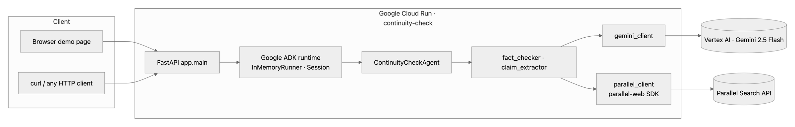
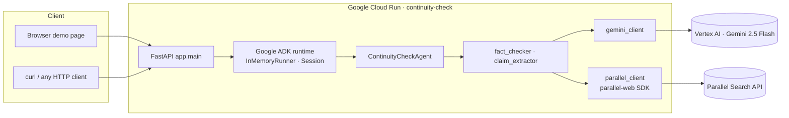
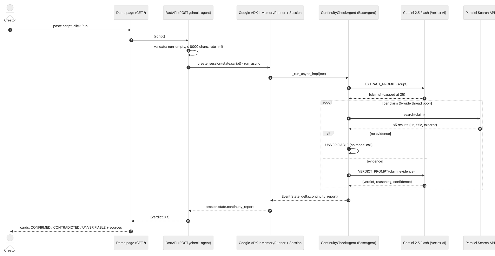
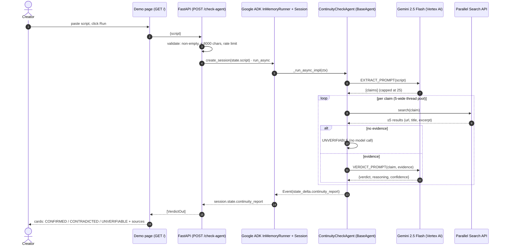
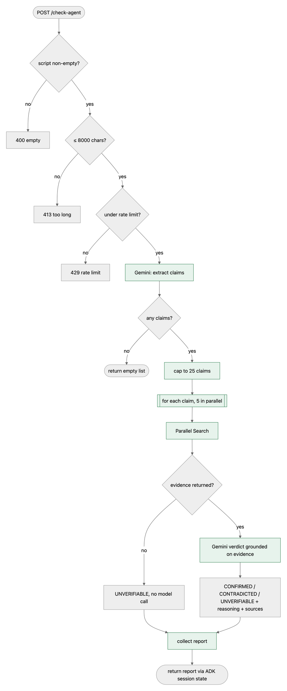
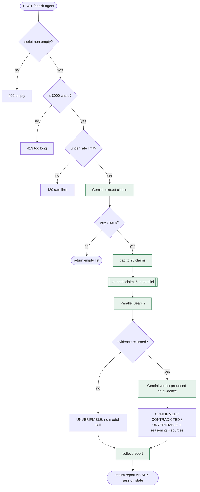
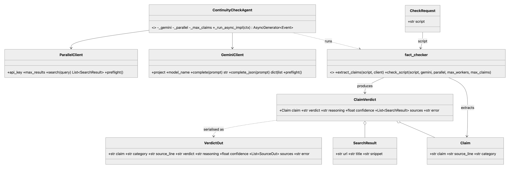
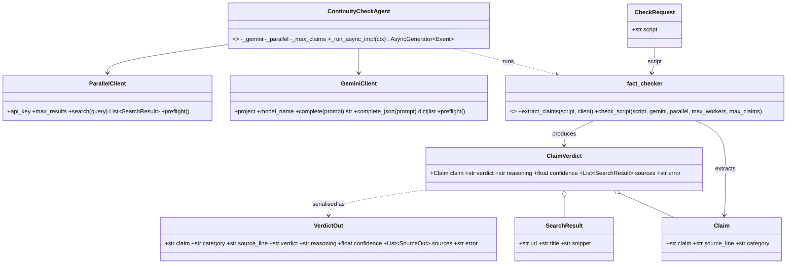
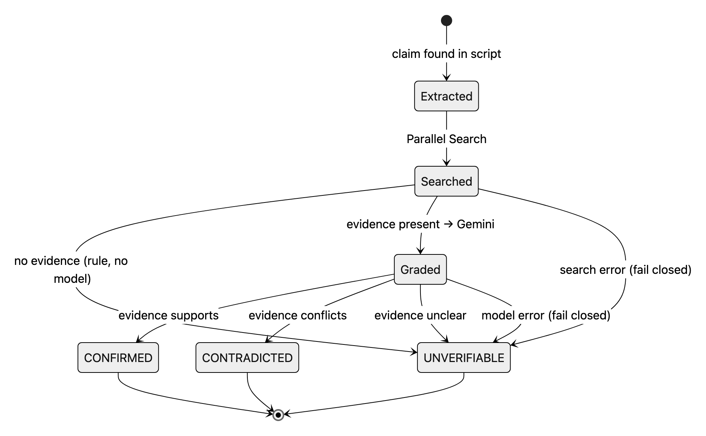
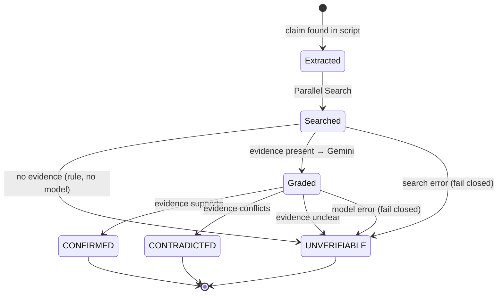

# Architecture

The control flow is **fixed**: the same steps in the same order on every request, no model choosing the next tool. The calls *inside* those steps (Gemini, Parallel Search) are live and not deterministic, so verdicts can change as the web does. The pure decision rules around those calls are specified and proven in [`verification/ContinuityCheck.lean`](verification/ContinuityCheck.lean) and checked against the Python by [`tests/test_spec_conformance.py`](tests/test_spec_conformance.py).

| Rule | Lean theorem | Python |
|---|---|---|
| No evidence ⇒ UNVERIFIABLE, model not consulted | `grade_no_evidence` | `fact_checker._check_one_claim` early return |
| A verdict is passed through, never invented | `grade_confirmed_sound`, `grade_contradicted_sound` | `ALLOWED_VERDICTS` collapse |
| Graded claims ≤ cap | `capClaims_le`, `pipeline_length` | `check_script(max_claims=25)` |
| Admitting a request never exceeds the window limit | `Limiter.allow_keeps_bound`, `Limiter.refuses_at_limit` | `_RateLimiter.allow` |

Check the spec yourself (Lean 4, no Mathlib, seconds): `cd verification && lean ContinuityCheck.lean`.

## UML

### Component diagram — what runs where

### Sequence diagram — one POST /check-agent

### Activity diagram — the fixed control flow (green = the pipeline steps that never vary)

### Class diagram — the data that flows through

### State diagram — the life of one claim

## Request path in prose

`POST /check-agent` → validate (non-empty, ≤ 8000 chars, rate limit) → Google ADK `InMemoryRunner` creates a session holding the script → `ContinuityCheckAgent._run_async_impl` → `check_script`: Gemini extracts claims (capped at 25) → for each claim, 5 in parallel: Parallel Search → no evidence ⇒ UNVERIFIABLE without a model call, else Gemini grades on that evidence only → the agent yields one Event whose `state_delta` carries the report → the endpoint returns it as `VerdictOut[]`.
